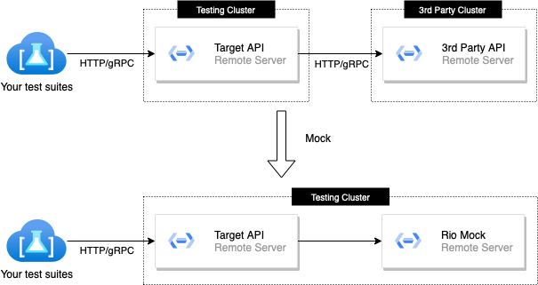

# Use Rio as a mock server to test Rest API

- [Use Rio as a mock server to test Rest API](#use-rio-as-a-mock-server-to-test-rest-api)
  - [Introduction](#introduction)
  - [Why mock?](#why-mock)
  - [Structure](#structure)

## Introduction

Suppose you want to perform integration tests for an API which is dependent on a 3rd party API, these services are deployed on different testing servers as the below diagram

This repository provides examples how to use [Rio](https://github.com/hungdv136/rio) as a mock server to simulate HTTP/gRPC endpoints. While this can be used for mocking HTTP requests in a JS based application, it is **NOT recommended** 

## Why mock?

- Create stable test suites by isolating your system with 3rd parties
- Able to simulate diversed scenarios to test how your system handles responses

## Structure

- [sdk](./sdk/README.md): TypeScript SDK to build and submit stubs to Rio remote server
- [example](./example/README.md): Examples for using Postman or SDK in JavaScript/TypeScript
- [server](./example/server/README.md): A sample test target API
- [docker](docker): A docker-compose example to deploy Rio